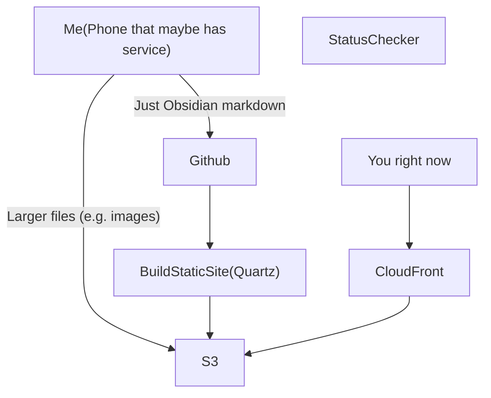

## Summary
This page has some details about how this whole note system works under the hood, and possibly a bit about why I made some of these terrible tech decisions (mostly so I can remember them later).

I've been using [Obsidian](https://obsidian.md/) for a good while now to do general note taking. Sometimes for work, sometimes for just daily things I try to make sure I have written down somewhere. The mobile app works pretty well and syncing between it and other systems is pretty straightforward because it is just a bunch of markdown for the most part. Some people go real crazy with plugins and write tons of code to get it to do neat things but I don't care too much about that. The goal here was to have a simple note taking interface I could carry thru whatever, and have that automatically sync to something where other people could read it if they want to see my notes throughout this process.

I was hoping that there would be a real simple out of the box solution to publish an Obsidian vault to a static website (there is I guess, but it is a service sold by Obsidian and I wanted a bit more control), but in the end I had to hack together a couple funky things.

## Architecture

## Local

Obsidian is installed on my phone where I'm making most of these notes and dumping images. I sync the Obsidian vault periodically to my [GitHub repo](https://github.com/adamkilpatrick/trail-notes) via an [android git client](https://github.com/ViscousPot/GitSync). This process ignores larger files like images or other attachments, which sync directly to an S3 bucket I own (I have no idea if GitHub will slap me for dumping GBs of images into a repo, but it feels wrong nonetheless, and I am too lazy to setup LFS). This also means all these notes are source controlled, so maybe there are some interesting uses for that (outside of letting everyone see where I fucked things up and deleted and retried things a million times).

For location tracking, I am using the [Automate](https://llamalab.com/automate/) app to periodically dump my lat/long location to a json payload under the "paths" directory so I get a map of where I am / where I have been. This also gets synced to github, deployed, and read for the interactive maps included.

## Build

Going from the Obsidian assets to a static site was more of a pain than I expected by a wide margin. In theory I could slam all the markdown into Jekyll or something, and could host on GitHub pages, but I have some need for AWS infra for some other pieces that may come later, and it is something I'm familiar with, so I wanted everything there. I settled on [Quartz](https://github.com/jackyzha0/quartz), which has worked pretty well so far, even with my very incorrect usage of it in a [GitHub action](https://github.com/adamkilpatrick/trail-notes/blob/main/.github/workflows/deploy-to-s3.yml). This will build the site every time I do one of the above mentioned syncs, which will then trigger a push to the S3 bucket I mentioned above (where any new large files have already been pushed).

## Hosting

Hosting is real straightforward. Static site lives in an S3 bucket and I point a CloudFront distribution at it so I can get some caching and ability to do some route tweaking. The infra code for that all lives at [adamkilpatrick/trail-notes-infra](https://github.com/adamkilpatrick/trail-notes-infra). This probably costs me 60 cents a month or something, as opposed to the 0 it would cost living in my VPS or in GitHub pages, or in Vercel, whatever, money isn't real.

There are a couple moving parts in the hosted infra. The main one right now is a scheduled lambda that checks for latest checkin time, latest location, and nabs some weather info, and then writes a daily status, which gets read from the index page.

Overall this setup seems to be working pretty well and hasn't fallen apart after 48 hours which, for any kind of software project, is pretty satisfying and unexpected.

## ToDo
- [ ] Wire in dead man switch
	- [x] Expose last check in time
- [x] Add location tracking